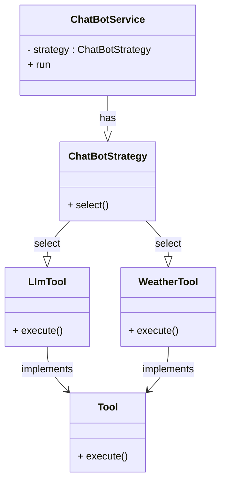
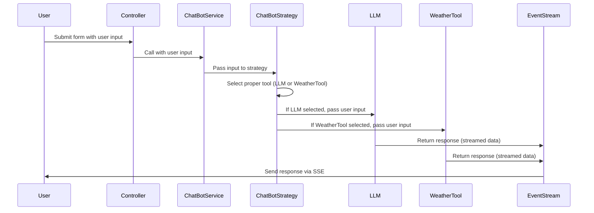

# CHATBOT

The app which utilizes OpenAI GPT (LLM) and implements tools for enhanced functionality. The chatbot handle user queries and leverage external tools or APIs to provide enriched responses.

**Features**

1. Chatbot interfaces with an LLM (e.g., OpenAI GPT, Anthropic Claude, Cohere, or an open-source alternative).
2. Chatbot implements at least one tool or API integration that the chatbot can use to enhance its responses (e.g., weather API, search engine, database lookup, or calculator).
3. Chatbot can decide when to use a tool versus relying on the LLM's response.
4. Chatbot ensures a seamless interaction between the user, LLM, and tool integrations

## SOLUTION

### Prerequisites

- VSCode
- Ruby 3.2.0
- Rails 7.1.1
- Bundler 2.6.6

### GITHub

Clone this repository to your local machine:

```bash
git clone https://github.com/dstajko/chatbot.git
```

### Build steps

1. Clone this repository to your local machine:
   ```bash
   git clone https://github.com/dstajko/chatbot.git
   ```
2. Run bundle installer (to install gems gems libs)
   ```bash
   bundle install
   ```
3. Run server
   ```bash
   rails server
   ```

### Containerization (Docker)

> **Note**: I added Dockerfile, as well as docker-compose.yml. Although I was very close to sort out ruby / rails library (gem) versions mismatch, I did not complete it(Ruby on Rails is well know for being complicated when it comes to gem management).

1. Build docker image

```bash
docker build -t app_name .
```

2. Run docker container

   ```bash
   docker run  -d -p 3000:80 app_name app_name
   ```

   **-d**, option to run in background

> **Missing**: I wanted to configure CI/CD pipeline, and connect to pull request webhooks with buildkite, but did not have enough time :-()

# Design Approach

Since I hadn’t worked with OpenAI before, I decided to explore GPT and try it out. I quickly built a Ruby on Rails web app and used event streams to send data from the server to the client.

## Backend

While diving deeper into AI agents, I came across [MCP (Multi-Context Processor)](https://modelcontextprotocol.io/), which seemed to be the right integration layer for my assignment.

> **Note**: Even though there are many guides online for using MCP with Python SDK and tools like Cursor or Claude, I decided to stick with my current project and build my own solution.

I used the **Strategy Design Pattern** to build a flexible solution that could handle multiple tools and API integrations. The business logic is in the **app/services** folder.



**LLMTool** and **WeatherTool** would be equivalent to models in the **M**CP

**ChatBotStrategy** implement business logic with decide on the write tool based on the context (user input) (could be considered as M**C**P)

**ChatBotService** is a just wrapper around selected strategy.

**Logger**. This class acts as just a wrapper for Rails logger, and outputs logs to STDOUT. Each tool instantiates its own logger.

**EventTracer**. It traces different events. Could be an interface with multiple implementations: Kafka events, or StatsD for sending metrics to services like DataDog or Observe. The tracing should be segmented per tool.

I added unit tests for each class to demonstrate unit testing approach (part of CI/CD pipeline)

> **Future extension**:
>
> 1. Implement tool/API integration discovery service
> 2. Implement the registry design pattern (maybe)
> 3. Fetch tool configurations from datastore, file, API

### Client Integration

The integration with the client is handled by the **ChatController**. The index page contains a form where the user can input their query, which is then sent to the **ChatResponsesController** and processed by **ChatBotService**. The response is processed and sent to the client using an event stream (SSE).

#### Sequence diagram



### Testing

I added unit tests the strategy design pattern actors, however they do not pass. They are now only to demonstrate unit test test strategy. These test files are in the **test/services** folder.
I was also planning to add integration tests, at the Rails controller level, however I ran out of time.

## References

[OpenAI](https://openai.com/)
[OpenWeatherMap API](http://api.openweathermap.org/data/2.5/weather)
[MCP](https://github.com/modelcontextprotocol)
[Rails](https://rubyonrails.org/)
[StrategyPatterDesign](https://www.geeksforgeeks.org/strategy-pattern-set-1/)
[AI Agents (IBM)](https://www.ibm.com/ai-agents)
